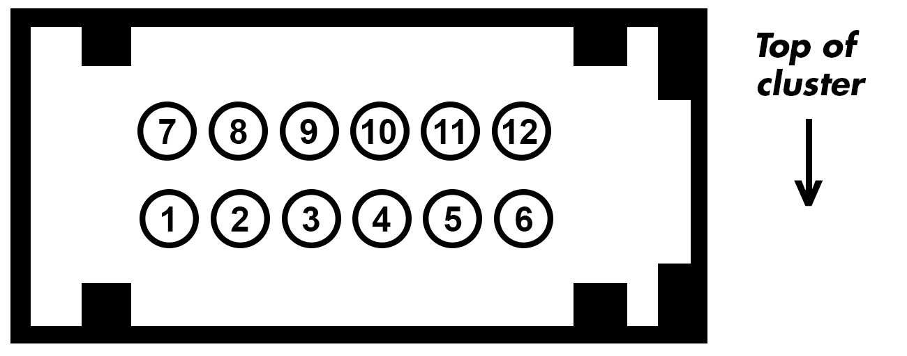

#
# MS Speed can bus messages for Ford Focus LW clusters 
I wanted to use the cluster from the focus to link up to race smims. Seeing as no one (form what I have seen) has published what CAN bus messages interact with the cluster I ended up doing it myself. So hopefuly someone out there finds this useful! :) 

Just a heads up as stated my main goal was just to get the cluster working outside the car so there are a few messages in this list I don't 100% know what they do or are for but are needed to make it "work" that being said I have tried to break them down as much as possible.

As a side note I had not looked into any of the I-CAN messages at this point in time just the MS bus messages. 

## Getting Started:
There firstly the most obvious thing you will need is a board to send the CAN messages there are a few boards you can use like on of the more popular options the [SeedStudio Arduino CANbus Shield](https://wiki.seeedstudio.com/CAN-BUS_Shield_V2.0/) or somehting like I had used [CANable dongle](https://canable.io/) (I had flashed mine with the knock off PCAN firmware). But that being said as long as your board can suport 125KBPS messaging your good to go!

## Hooking things up:

 

## MS Bus Meesage overview
The meesages I have taken a look that are either fully or partialy decoded are:

<table class="tg">
<thead>
  <tr>
    <th class="tg-c3ow">ID</th>
    <th class="tg-c3ow">Description</th>
  </tr>
</thead>
<tbody>
  <tr>
    <td class="tg-c3ow">0x03A</td>
    <td class="tg-c3ow" colspan="2">Indicators, Washer Fluid level and steering assist </td>
  </tr>
  <tr>
    <td class="tg-c3ow">0x080</td>
    <td class="tg-c3ow" colspan="2">The cluster "State/Wake" signal</td>
  </tr>
  <tr>
    <td class="tg-c3ow">0x040</td>
    <td class="tg-c3ow" colspan="2">Airbag state and odomiter</td>
  </tr>
  <tr>
    <td class="tg-c3ow">0x1B0</td>
    <td class="tg-c3ow" colspan="2">Hill start assist system state (Manual and Auto?)</td>
  </tr>
  <tr>
    <td class="tg-c3ow">0x098</td>
    <td class="tg-c3ow" colspan="2">ABS, Stability and traction control, backlight brightness</td>
  </tr>
  <tr>
    <td class="tg-c3ow">0x042</td>
    <td class="tg-c3ow" colspan="2">Immobilizer status</td>
  </tr>
  <tr>
    <td class="tg-c3ow">0x060</td>
    <td class="tg-c3ow" colspan="2">Seat belt light</td>
  </tr>
  <tr>
    <td class="tg-c3ow">0x060</td>
    <td class="tg-c3ow" colspan="2">RPM and Speed</td>
  </tr>
  <tr>
    <td class="tg-c3ow">0x290</td>
    <td class="tg-c3ow" colspan="2">Break fluid status</td>
  </tr>
  <tr>
    <td class="tg-c3ow">0x2A0</td>
    <td class="tg-c3ow" colspan="2">Without this the "Engine malfunction" alert is triggered</td>
  </tr>
  <tr>
    <td class="tg-c3ow">0x240</td>
    <td class="tg-c3ow" colspan="2">Park break (See message for more detail)</td>
  </tr>
    <tr>
    <td class="tg-c3ow">0x250</td>
    <td class="tg-c3ow" colspan="2">Engine light</td>
  </tr>
    <tr>
    <td class="tg-c3ow">0x320</td>
    <td class="tg-c3ow" colspan="2">Fuel</td>
  </tr>
     <tr>
    <td class="tg-c3ow">0x300</td>
    <td class="tg-c3ow" colspan="2">Alternator light</td>
  </tr>     
     <tr>
    <td class="tg-c3ow">0x1B4</td>
    <td class="tg-c3ow" colspan="2">Headlight and Lamps</td>
  </tr>     
    <tr>
    <td class="tg-c3ow">0x1A4</td>
    <td class="tg-c3ow" colspan="2">Trip computer: Outside temperature</td>
  </tr>     
    <tr>
    <td class="tg-c3ow">0x1A8</td>
    <td class="tg-c3ow" colspan="2">Trip computer: Range remaining</td>
  </tr>     
  </tr>     
    <tr>
    <td class="tg-c3ow">0x250</td>
    <td class="tg-c3ow" colspan="2">Oil light</td>
  </tr>     

</tbody>
</table>

